# AWS Practical Laboratory Report

**Student Name:** Kinley Palden

**Student ID:** 02230287

**Course:** DSO303

**Lab Number / Title:** Lab 01: Identity and Access Management (IAM)

**Date:** 2026-08-22
 
---

## 1. Aim / Objective

To bootstrap a reproducible, local AWS emulation environment (Floci, via Docker Compose) and to build a complete IAM foundation for the University Student Management System (USMS) using the AWS CLI: creating users, groups, customer-managed and inline policies, roles with trust policies, an instance profile, and temporary credentials via STS, while applying the principle of least privilege and preventing any secret from ever being committed to Git.

---

## 2. Introduction

AWS Identity and Access Management (IAM) is the service that controls **who** (identity) can do **what** (permissions) to **which** AWS resources. It is a global service: IAM users, groups, roles and policies are not tied to any region.

Its four core building blocks are:

- **User**: a permanent identity for a person or long-lived program.
- **Group**: a container of users that permissions attach to.
- **Role**: an identity with no permanent credentials, assumed to obtain temporary, auto-expiring credentials.
- **Policy**: a JSON document that allows or denies specific API actions on specific resources, optionally under conditions.

IAM's default-deny model, combined with the rule that an explicit `Deny` always overrides any number of `Allow` statements, is what makes it possible to build safe guardrails even in an environment where mistakes are otherwise easy to make. IAM is foundational to every other AWS service: EC2 instances need roles to reach S3 safely, Lambda functions need execution roles to write logs, and every audit or compliance process in a real organisation starts by asking "which identity was able to do this, and why."

This lab was performed entirely against **Floci**, a local, Docker-based AWS emulator, rather than a real AWS account, allowing every command to be run for free, offline, and without risk, while still using the real, unmodified AWS CLI.

---

## 3. Use Case

IAM is used in essentially every real-world AWS deployment. Typical examples include:

- Separating a DevOps team into least-privilege groups (developers, auditors, administrators) instead of sharing one root login.
- Giving an EC2 web server temporary, auto-rotating credentials through an instance role instead of hard-coding a permanent access key on disk.
- Giving a Lambda function only the specific permissions it needs (e.g. read one S3 bucket, write its own logs) through an execution role.
- Using a policy simulator or CloudTrail logs to diagnose `AccessDenied` errors during a security audit.

In this lab, the same patterns were applied to a fictional university system (USMS): a developer group that can build infrastructure but not touch identities, an auditor group with read-only access, and dedicated service roles for the EC2 application server and a Lambda notification function.

---

## 4. System Architecture / Design

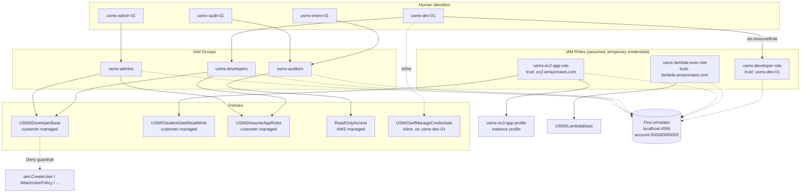

The diagram shows the four human identities placed into their groups from birth, the customer-managed and AWS-managed policies attached at the group level (never directly to users, per course convention), the one deliberate inline-policy exception (`USMSSelfManageCredentials` on `usms-dev-01`), and the three service/human roles with their trust relationships, all evaluated by the Floci emulator standing in for real AWS.

*Image Source: authored for this lab (Mermaid diagram, not an external screenshot).*

---

## 5. Implementation Procedure

All commands were run with the AWS CLI v2 against Floci's endpoint (`http://localhost:4566`), using the `floci` AWS CLI profile, from the project root `~/Desktop/DSO303/aws-floci-course`. Steps are documented below in order; some purely conceptual steps (e.g. Step 16) have no accompanying command.

 

### Part A: Environment Setup

 

#### Step 1: Identify the system

Printed OS, architecture and `$HOME` (`uname -s -m`, `$SHELL`, `$HOME`) to confirm a Linux/Kali x86_64 environment before anything else was installed.

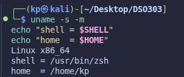

 

#### Step 2: Verify Docker and Docker Compose

Confirmed `docker --version`, `docker info`, and `docker compose version` (Compose v2) all succeed, proving the daemon is reachable.

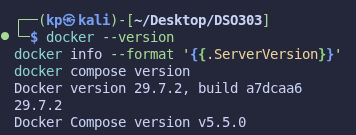

 

#### Step 3: Install the Floci CLI

Installed via the official install script and verified with `floci version` (CLI present, server not yet running, expected before Step 9).

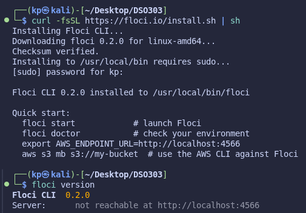

 

#### Step 4: Run `floci doctor`

Diagnostics confirmed Docker/daemon/socket/port checks pass; image/container/endpoint checks correctly showed not-yet-present, since nothing had been started yet (that happens via Compose in Step 9, not `floci start`).

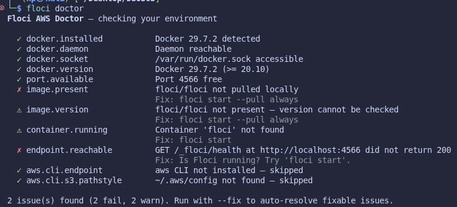

 

#### Step 5: Create the project directory structure

Built the full `aws-floci-course/` tree (`labs/`, `policies/`, `configs/`, `scripts/{setup,utilities,cleanup}`, `templates/`, `outputs/`, `screenshots/`, `notes/`) with `mkdir -p`, verified with `find . -type d`.

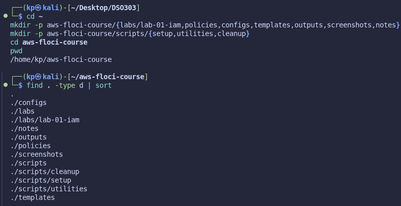

 

#### Step 6: Write `.gitignore` and initialise Git before any secret exists

Wrote ignore rules (using `outputs/*` + `!outputs/.gitkeep`, not `outputs/`, to correctly re-include the placeholder), ran `git init`, and proved the rule works by creating a fake secret file, confirming it never appears in `git status`, and that `git check-ignore -v` names the exact blocking rule. Committed `.gitignore` as the repository's first commit.

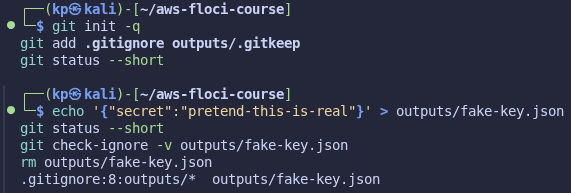

 

#### Step 7: Understand Floci's storage modes

Read through the four storage modes (`memory`, `hybrid`, `persistent`, `wal`) and why a bind mount alone (`--persist`) does not make state durable without `FLOCI_STORAGE_MODE=hybrid`. Recorded a written reflection in `notes/lab-01-notes.md` answering why a correctly mounted directory still stays empty in `memory` mode.

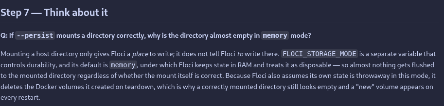

 

#### Step 8: Write `docker-compose.yml` and `configs/course.env`

Captured the three settings that make persistence real (`FLOCI_STORAGE_MODE`, `FLOCI_STORAGE_PERSISTENT_PATH`, `FLOCI_STORAGE_HOST_PERSISTENT_PATH`) into version-controlled files. Verified the Compose file's `${FLOCI_HOST_DATA_DIR:?...}` guard correctly refuses to run before `.env` exists.

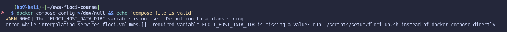

 

#### Step 9: Write `floci-up.sh` / `floci-down.sh` and start Floci

Brought the container up through Compose (first run pulled the `floci/floci:latest` image), and verified it three independent ways: `docker compose ps` (healthy), `floci status` (reachable), and a raw `curl` to `/_floci/health`. Confirmed `/app/data` is a real bind mount to `~/floci-data`, not a phantom volume.

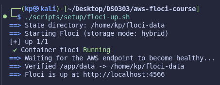

 

#### Step 10: Install AWS CLI v2

Installed via the official `awscli-exe-linux-x86_64.zip` installer (not `apt install awscli`, which installs v1), verified `aws --version` reports `2.x` (>= 2.13, required for native `endpoint_url` profile support).

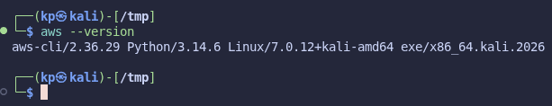

 

#### Step 11: Understand credentials, regions and profiles

Reviewed the four values every CLI command needs (access key, secret key, region, endpoint URL), the credential-resolution order, and why this course deliberately uses named profiles rather than mixing in `AWS_ENDPOINT_URL`/`AWS_ACCESS_KEY_ID` environment variables.

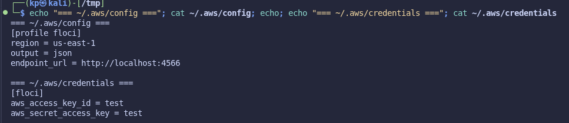

 

#### Step 12: Create the `floci` AWS CLI profile

Ran `aws configure set` five times (dummy `test`/`test` credentials, region `us-east-1`, `endpoint_url` pointing at Floci), then confirmed the resulting `~/.aws/config` (`[profile floci]`) and `~/.aws/credentials` (`[floci]`), noting the naming asymmetry between the two files.

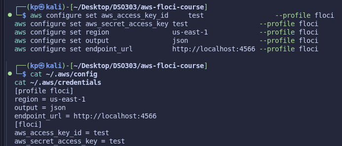

 

#### Step 13: First AWS CLI call, and the `whoami.sh` helper

`aws sts get-caller-identity` returned account `000000000000` (Floci's fixed dummy account), confirming connectivity. Wrote and ran `scripts/utilities/whoami.sh`, which prints the active profile/endpoint and refuses to stay quiet if the account is ever anything other than the Floci account.

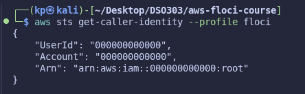

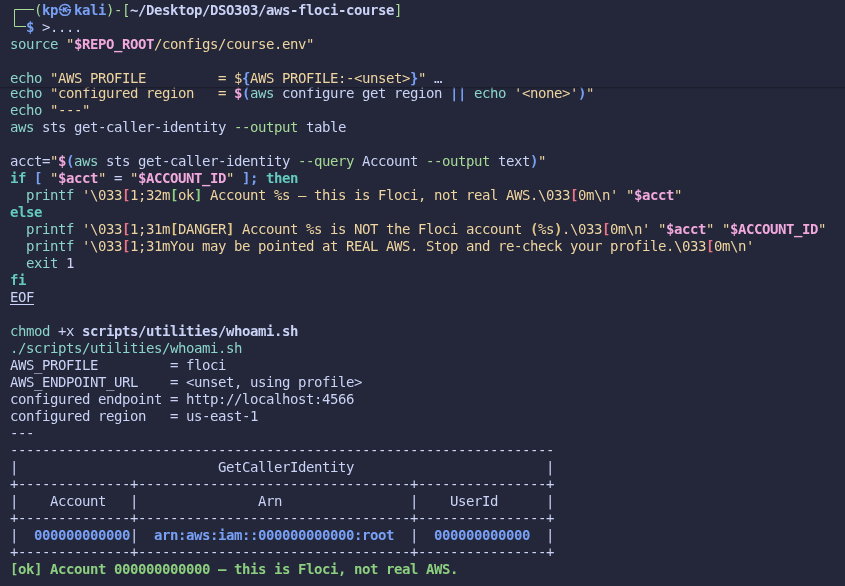

 

#### Step 14: Prove isolation from real AWS, and prove persistence

Four independent proofs were performed:

1. The account number itself.
2. `--debug` output showing the actual request URL was `http://localhost:4566`, not `amazonaws.com`.
3. Stopping the container and confirming the CLI immediately fails to connect.
4. The real persistence test: creating an IAM user, doing a full container restart (`docker compose restart`), and confirming the user still exists afterward, backed up by inspecting real files under `~/floci-data`.

Also confirmed AWS CLI v2 exit-code conventions (`0` success, `254` service error such as `NoSuchEntity`).

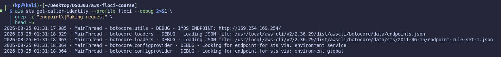

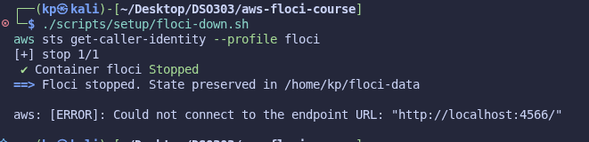

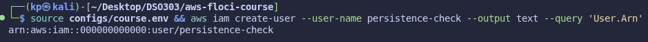

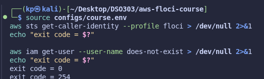

 

#### Step 15: Storage diagnostics, README, and the Part A commit

Wrote `scripts/utilities/floci-storage-check.sh` (a six-part read-only diagnostic, all sections reported `[ok]`) and `scripts/cleanup/floci-prune-volumes.sh`, wrote the project `README.md`, and committed all of Part A's work with `.gitignore` intact as the historically-first commit.

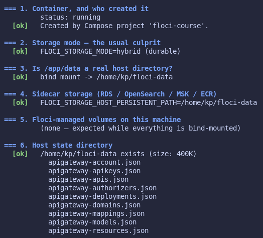

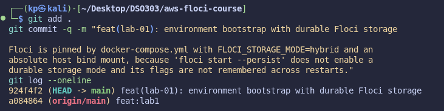

 

### Part B: Building the IAM Foundation

 

#### Step 16: IAM concepts and ARN anatomy

Conceptual only, no commands. Studied the four IAM building blocks, permissions-vs-trust policies, the three ways a policy can be attached, ARN structure, and the policy evaluation logic (default-deny, explicit-deny-always-wins).

*(No screenshot: purely conceptual step.)*

 

#### Step 17: Inspect the empty IAM account

`aws iam list-users` returned an empty list, then the same data was compared across `json`, `table`, and `text` output formats, and `aws iam list-roles --output table` was run as the "Your turn" exercise.

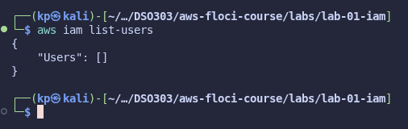

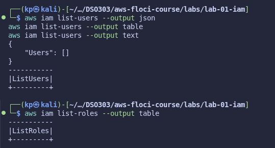

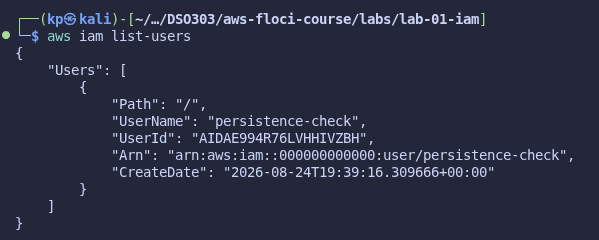

 

#### Step 18: Create the IAM groups

Created `usms-admins`, `usms-developers`, `usms-auditors` with `aws iam create-group`, verified via `list-groups --query 'Groups[*].[GroupName,Arn]'`.

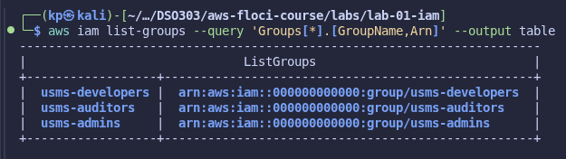

 

#### Step 19: Create the IAM users and capture their ARNs

Created `usms-admin-01`, `usms-dev-01`, `usms-audit-01` with tags, capturing each ARN into a shell variable via `--query`/`--output text`. "Your turn": created a fourth user `usms-intern-01` (tag `Role=Intern`), captured `INTERN_ARN`, and displayed its `UserId` (`AIDA...`).

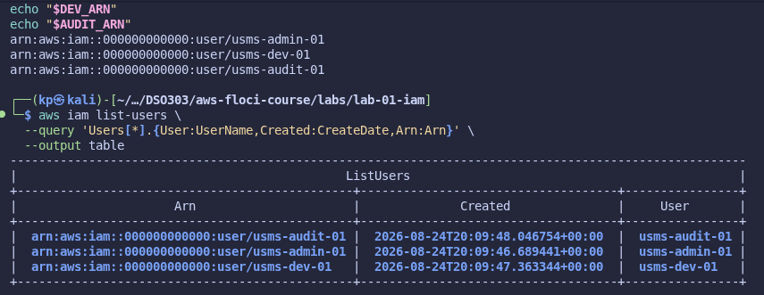

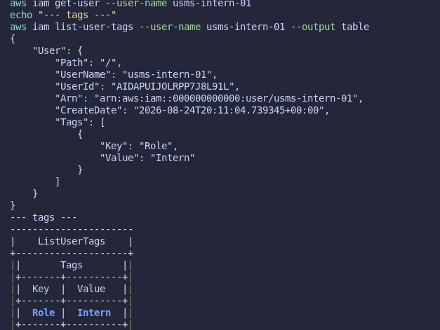

 

#### Step 20: Add users to groups

Linked each user to its group with `add-user-to-group`, verified membership from both directions (`get-group` and `list-groups-for-user`). "Your turn": added `usms-intern-01` to `usms-auditors` and confirmed the group now has two members.

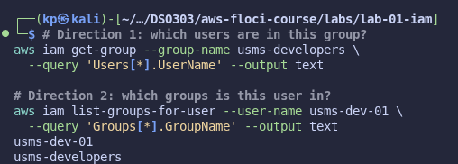

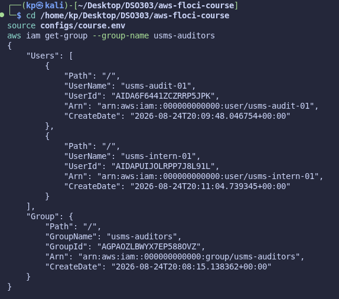

 

#### Step 21: Attach an AWS managed policy

Attached `arn:aws:iam::aws:policy/ReadOnlyAccess` to `usms-auditors`, verified with `list-attached-group-policies`.

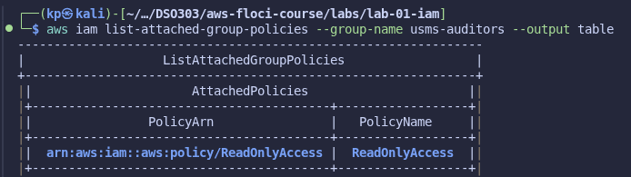

 

#### Step 22: Write the first customer-managed policy

Authored `USMSDeveloperBase` from scratch: a read-everything statement, a narrowly-scoped VPC-building statement conditioned on `us-east-1`, and an explicit `Deny` statement blocking identity-escalation actions (`iam:CreateUser`, `iam:AttachUserPolicy`, etc.) as a privilege-escalation guardrail. Validated the JSON locally before submitting, created the policy, and attached it to both `usms-developers` and `usms-admins`.

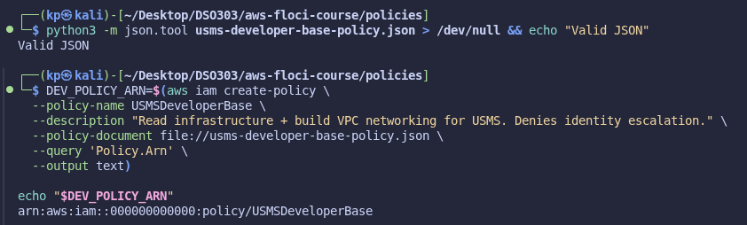

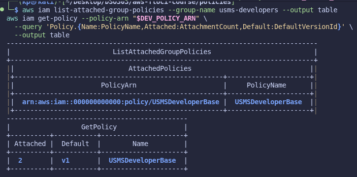

 

#### Step 23: Write the S3 data policy

Authored `USMSStudentDataReadWrite`, correctly distinguishing the bucket ARN (`s3:ListBucket`) from the object ARN (`.../*`, for `GetObject`/`PutObject`/`DeleteObject`) plus an explicit `Deny` on `s3:DeleteBucket`.

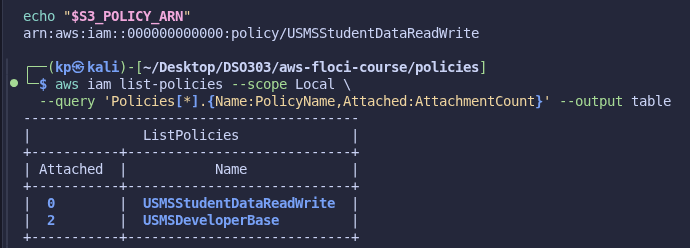

 

#### Step 24: `--generate-cli-skeleton`

Generated a parameter skeleton for `aws iam create-role` (main exercise), then for `aws iam create-policy` and `aws ec2 create-vpc` ("Your turn"), all saved under `templates/`.

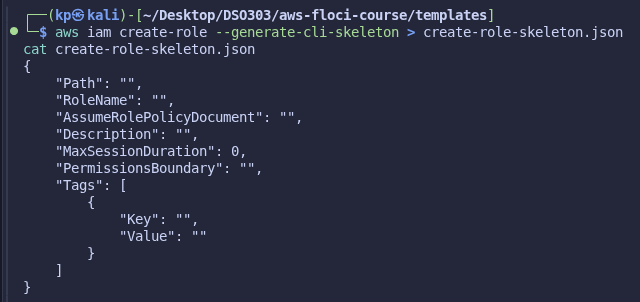

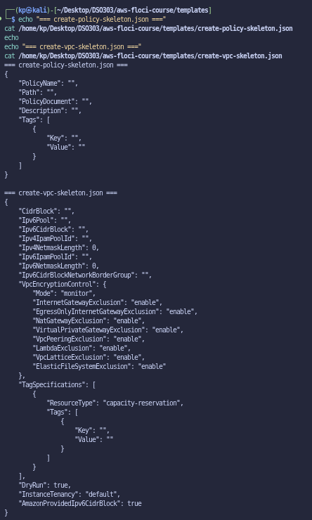

 

#### Step 25: Inline policy for self-service credentials

Authored `USMSSelfManageCredentials`, using the `${aws:username}` policy variable so one document scopes correctly per-user, and attached it as an inline policy to `usms-dev-01` via `put-user-policy` (quoted heredoc, to avoid the shell expanding the policy variable).

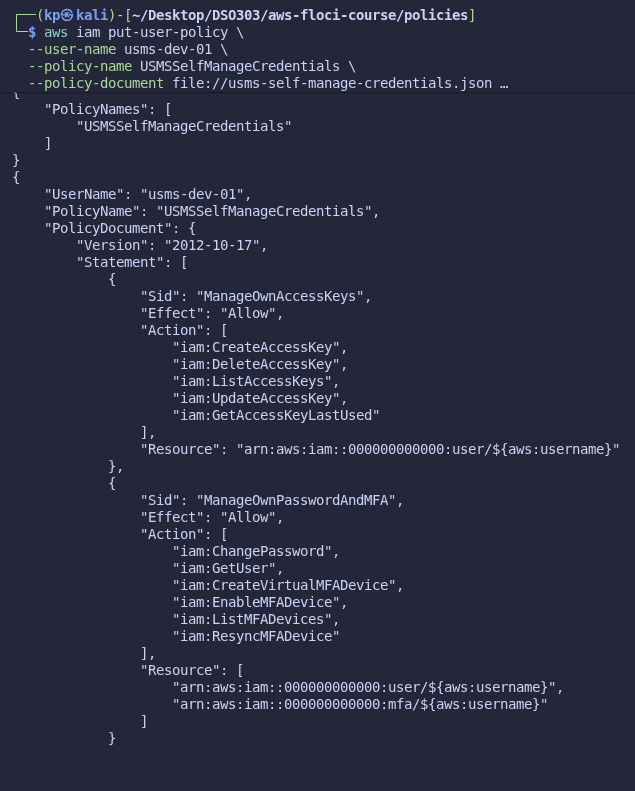

 

#### Step 26: Inspect what was built

Ran the full four-way audit of `usms-dev-01` (groups, attached policies, inline policies, access keys), read back `USMSDeveloperBase`'s live document via `get-policy` + `get-policy-version`, and produced an account-wide IAM snapshot. Floci's `get-account-authorization-details` returned `UnsupportedOperation` on this build, so an equivalent snapshot was assembled from individual `list`/`get` calls with `jq` and saved to `outputs/lab-01-iam-snapshot.json`.

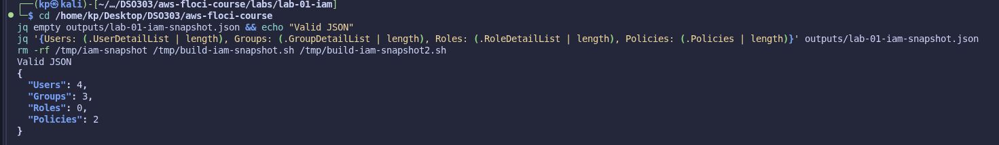

 

#### Step 27: Policy versions

Programmatically added `ec2:DeleteVpc` and `ec2:DescribeAvailabilityZones` to `USMSDeveloperBase`'s `BuildNetworkingForLab02` statement, created a new policy version with `--set-as-default`, and verified `v2` is now default while `v1` remains available for rollback.

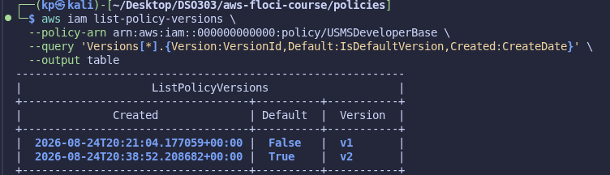

 

#### Step 28: EC2 role with trust policy

Created `usms-ec2-app-role` with a trust policy naming `ec2.amazonaws.com` as principal, attached `USMSStudentDataReadWrite` as its permissions policy, and wrapped it in the instance profile `usms-ec2-app-profile` (required because EC2 cannot take a role directly).

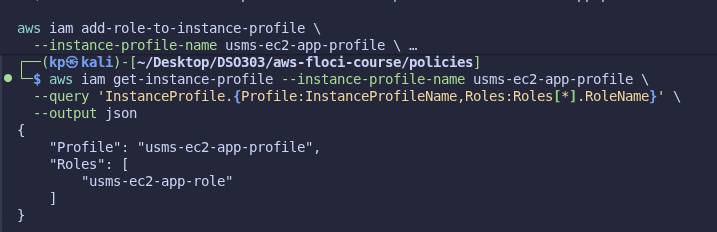

 

#### Step 29: Lambda execution role

Created `usms-lambda-exec-role` (trust: `lambda.amazonaws.com`) with `USMSLambdaBasic` (CloudWatch Logs write + read access to student data), verified with a `starts_with(RoleName, 'usms-')` JMESPath filter across all roles.

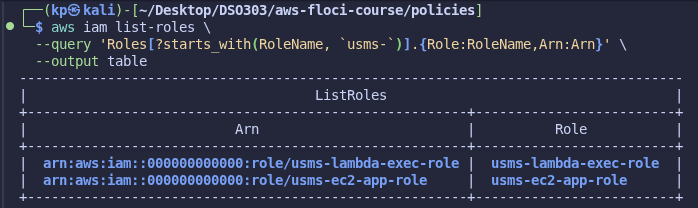

 

#### Step 30: Human role and temporary STS credentials

Created `usms-developer-role` with an account-principal trust policy naming `usms-dev-01`, attached `USMSDeveloperBase`, and created `USMSAssumeAppRoles` so the developers/admins groups may actually call `sts:AssumeRole` (the "two-sided handshake"). Assumed the role, confirmed the resulting credentials begin with `ASIA` (temporary) and include a `SessionToken`, used them via environment variables, then explicitly unset them and confirmed `whoami.sh` reported the identity back to the account root.

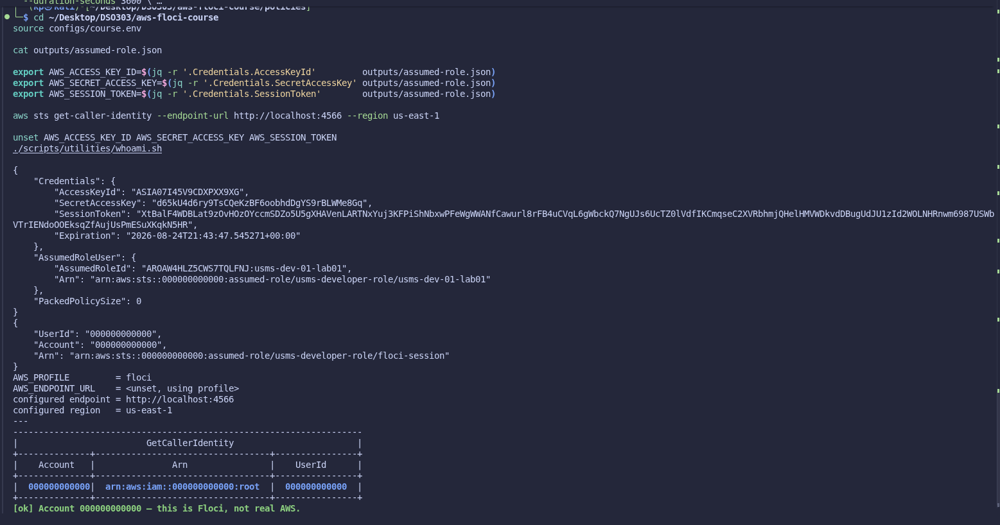

 

#### Step 31: Access keys, handled safely

Created a real (Floci-dummy) access key for `usms-dev-01`, redirected straight to `outputs/usms-dev-01-access-key.json` (never printed to screen) and `chmod 600`'d it. Confirmed with three independent checks that Git would never commit it: absent from `git status`, named explicitly by `git check-ignore -v` (caught by the `*-access-key.json` rule), and correct file permissions. Built a second CLI profile, `usms-dev`, using the new key and confirmed it resolves to `usms-dev-01`.

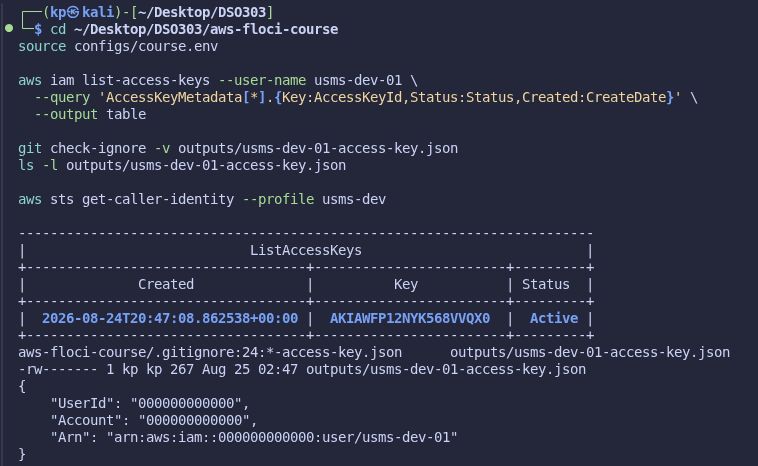

 

#### Step 32: Policy simulator

Ran `simulate-principal-policy` for `usms-dev-01` against three actions, discovering that a conditioned `Allow` (region-scoped `ec2:CreateVpc`) evaluates as `implicitDeny` unless the matching `--context-entries` are supplied, a genuine AWS evaluation-engine behaviour, not a Floci bug.

"Your turn": predicted `usms-audit-01`'s decision on `ec2:CreateVpc` (implicit deny expected) and `ec2:DescribeVpcs` (allowed expected) before testing; the test surfaced a real Floci limitation: this build's bundled `ReadOnlyAccess` policy is a stub (`Action: "*"`) rather than the real AWS managed policy, so both actions came back `allowed`. Documented the prediction, the actual result, and the root cause in `notes/lab-01-notes.md`.

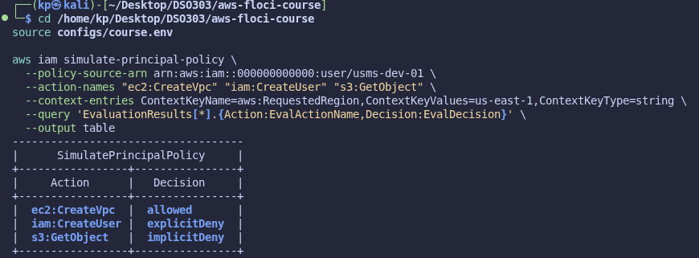

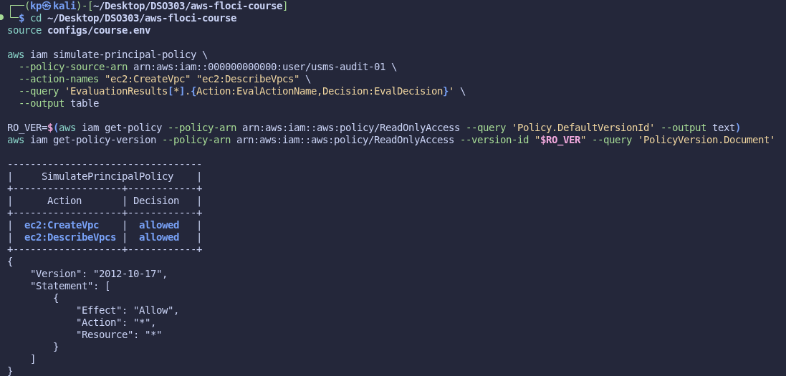

 

#### Step 33: Save lab state for future labs

Generated `configs/lab-01.env` with every ARN Lab 2+ will need (confirmed no value was left empty/`None`), attempted `floci snapshot save` (unsupported on this Floci build: `Snapshot API not available on this server version`) and used the documented filesystem fallback instead (`floci-down.sh` -> `tar -czf ~/floci-data-lab-01.tar.gz` -> `floci-up.sh`), kept outside the repository as required. Lab notes and the final commit complete this step.

*(In progress at time of writing: no screenshot yet for this step.)*

---

## 6. Results and Evidence

### 6.1 CLI Output

**Screenshot 1: Environment health proof (Step 9)**

*Image Source: `aws-floci-course/screenshots/lab1/s9.png`*

 

**Screenshot 2: Isolation and persistence proof (Step 14)**

*Image Source: `aws-floci-course/screenshots/lab1/s14.2.png`*

 

**Screenshot 3: Full IAM foundation snapshot (Step 26)**

*Image Source: `aws-floci-course/screenshots/lab1/s26.png`*

 

**Screenshot 4: Temporary STS credentials via assume-role (Step 30)**

*Image Source: `aws-floci-course/screenshots/lab1/s30.png`*

 

**Screenshot 5: Access key created and proven git-ignored (Step 31)**

*Image Source: `aws-floci-course/screenshots/lab1/s31.png`*

 

All 42 step-by-step screenshots referenced in Section 5 above (`s1.png` through `s32myturn.png`) constitute the complete CLI evidence trail for this lab and are stored in `aws-floci-course/screenshots/lab1/`.

### 6.2 AWS Console Verification

Not applicable. Floci is a CLI-only local emulator with no web console; all verification in this lab was performed and evidenced through the AWS CLI itself (`get-*`, `list-*`, `--query`, `--output table`), which is the equivalent evidence source for a console-less environment.

---

## 7. Analysis and Discussion

All 33 steps of the lab were completed successfully, resulting in a fully reproducible local IAM foundation: 4 groups/users are correctly separated (never attaching permissions directly to a user, per course convention, with one deliberate inline-policy exception), 5 customer-managed/inline policies correctly implement least privilege including explicit-deny guardrails, and 3 roles correctly separate service identities (EC2, Lambda) from a human-assumable role, each backed by both a trust policy and a permissions policy.

Several real errors and Floci-specific limitations were encountered and resolved during the lab:

- **Working-directory / path drift.** The lab's example commands assume the project lives at `~/aws-floci-course`, but this project's actual location, a pre-existing Git-tracked submission repository, was `~/Desktop/DSO303/aws-floci-course`. This caused repeated "No such file or directory" errors (Steps 21, 26, 30, 31) whenever a command used a literal `~/aws-floci-course/...` path or was run from the wrong working directory. Resolved each time by substituting the real project path.

- **`.env` accidentally committed.** An early bulk commit included the generated `.env` file despite it being listed in `.gitignore`, because a file already staged with `git add` is no longer subject to gitignore rules retroactively. Fixed with `git rm --cached .env` followed by a corrective commit, and confirmed `git check-ignore` now correctly reports it as ignored going forward.

- **Leftover `persistence-check` user.** The Step-14 marker user reappeared in `aws iam list-users` at the start of Part B, exactly the scenario the lab warns about, and was removed with `aws iam delete-user` before continuing.

- **Floci coverage gaps.** Two Floci API calls were unsupported on this build's edition (`floci-always-free`, server 1.7.0): `aws iam get-account-authorization-details` (`UnsupportedOperation`) and `floci snapshot save` (`Snapshot API not available on this server version`). Both have documented workarounds in the lab (assembling an equivalent snapshot from individual API calls with `jq`; a `tar`-based filesystem snapshot instead), both of which were used successfully.

- **Floci's bundled `ReadOnlyAccess` is not the real AWS policy.** The Step 32 policy simulator "Your turn" exercise surfaced that this Floci build's `arn:aws:iam::aws:policy/ReadOnlyAccess` is a stub granting `Action: "*"` rather than the real AWS policy's long enumerated read-only action list, meaning an auditor in this emulator is accidentally granted full access. This is an important, concrete illustration of the lab's stated caveat that Floci's policies are stored and syntactically validated correctly, but specific managed-policy *content* can diverge from real AWS.

- **Policy conditions need explicit context in the simulator.** A conditioned `Allow` statement (region-scoped `ec2:CreateVpc`) evaluated as `implicitDeny` in `simulate-principal-policy` until the matching `--context-entries` were supplied, correct, real AWS evaluation behaviour, not a bug, and a useful lesson in how condition keys are actually resolved.

- **`sudo`-requiring installs** (AWS CLI v2, `jq`) could not be completed non-interactively and required running the commands directly in an interactive terminal to supply a password.

All observed outputs matched the lab's documented expected results once the above issues were corrected, confirming the IAM foundation is correctly built and ready for Lab 2 (VPC) to consume via `configs/lab-01.env`.

---

## 8. Reflection

**1. What did you learn about this AWS service?**

IAM's core value is in its separation of concerns: identity (who), permission (what), and trust (who may become what) are three distinct, independently-managed layers, and nearly every real-world "it's not working" IAM problem traces back to one of those three layers being incomplete, most commonly a trust policy present with no matching caller-side permission, or vice versa (the "two-sided handshake"). The distinction between an implicit and an explicit deny is also central: one is fixed by adding a permission, the other cannot be fixed by adding permissions at all.

**2. What challenges did you encounter?**

The most persistent challenge was environmental: the lab's example paths assumed a project location that did not match this course's actual submission repository, which produced repeated, easily-misread "file not found" errors that had nothing to do with IAM itself. The second challenge was recognising when a surprising result (e.g. `ec2:CreateVpc` unexpectedly `allowed` for an auditor) was a genuine emulator limitation rather than a mistake in the policy that had just been written, which required inspecting the actual policy document behind the AWS-managed policy name rather than trusting the name.

**3. How would you apply this service in a real-world cloud environment?**

Directly as built here: group-based permission assignment, roles instead of long-lived keys for anything automatable (servers, functions), an explicit-deny guardrail against privilege escalation, and access keys that are created once, stored outside version control, and rotated using the two-key overlap procedure rather than being replaced destructively.

**4. What additional concepts or features would you like to explore?**

Permission boundaries and Service Control Policies (SCPs), the two enforcement layers mentioned but out of scope for this lab, plus how CloudTrail-based auditing turns the assumed-role session-name pattern used in Step 30 into an actual forensic trail in a real account.

---

## 9. Conclusion

This lab's objectives were fully achieved: a reproducible Floci environment was bootstrapped with proven durability and proven isolation from real AWS, and a complete, least-privilege IAM foundation was built for USMS: three human-facing groups and users, three service/human roles each with both a trust and a permissions policy, five custom or inline policies including an explicit-deny privilege-escalation guardrail, and a set of shell scripts and configuration files that make the entire environment restartable from a single command.

Key concepts learned include the users/groups/roles/policies model, ARN structure, permissions-vs-trust policies, policy versioning, `--query`/JMESPath, temporary STS credentials, and safe secret handling via `.gitignore`. Skills developed include reading and writing AWS CLI commands directly rather than through a console, debugging real path/`sudo`/Git errors under time pressure, and critically verifying an emulator's behaviour against documented AWS behaviour rather than assuming a mismatch is user error.

This IAM foundation, recorded in `configs/lab-01.env`, is what Lab 2 (VPC) and subsequent labs will build directly on top of.

---

## 10. Appendix

| Item | Path |
|---|---|
| Policy documents | `aws-floci-course/policies/*.json` |
| Generated ARNs for later labs | `aws-floci-course/configs/lab-01.env` |
| CLI parameter skeletons | `aws-floci-course/templates/` |
| Full IAM snapshot (substitute for `get-account-authorization-details`) | `aws-floci-course/outputs/lab-01-iam-snapshot.json` |
| Filesystem state snapshot (kept outside the repository, not committed) | `~/floci-data-lab-01.tar.gz` |
| Lab notes and predictions | `aws-floci-course/notes/lab-01-notes.md` |
| All screenshots | `aws-floci-course/screenshots/lab1/` |

Policy documents in detail: `usms-developer-base-policy.json` and `-v2.json`, `usms-student-data-rw-policy.json`, `usms-self-manage-credentials.json`, `usms-assume-app-roles-policy.json`, `usms-lambda-basic-policy.json`, `trust-ec2.json`, `trust-lambda.json`, `trust-account-developers.json`.

---

## Submission Checklist

- [x] Student information completed
- [x] Objectives stated
- [x] Introduction provided
- [x] Real-world use case described
- [x] Tools listed
- [x] System design included
- [x] Implementation documented
- [x] CLI outputs included
- [ ] Console screenshots attached *(not applicable: Floci is CLI-only, no web console)*
- [x] Analysis completed
- [x] Reflection completed
- [x] Conclusion written
- [x] Appendix attached
