# AWS Practical Laboratory Report

**Student Name:** Kinley Palden

**Student ID:** 02230287

**Course:** DSO303

**Lab Number / Title:** Lab 02: VPC (Virtual Private Cloud)

**Date:** 2026-08-27

---

## 1. Aim / Objective

To design and build a two-tier VPC network for the University Student Management System (USMS) using the AWS CLI: a VPC with public and private subnets across two Availability Zones, an internet gateway and NAT gateway, route tables, security groups, a network ACL, and an S3 gateway endpoint, all created as the least-privileged `usms-developer-role` established in Lab 01, and all proven to survive a Floci restart.

---

## 2. Introduction

Amazon VPC (Virtual Private Cloud) is the networking layer every other AWS service is built on top of. It lets an account carve out an isolated, privately addressed network inside AWS, then subdivide it into subnets, control traffic between them with route tables, and filter traffic at two independent layers: security groups (stateful, instance-level) and network ACLs (stateless, subnet-level).

The building blocks used in this lab are:

- **VPC**: an isolated IPv4 address range (a CIDR block) that is the outer boundary of everything else.
- **Subnet**: a slice of the VPC's CIDR, tied to one Availability Zone, that becomes "public" or "private" purely through its route table, not through any property of the subnet itself.
- **Internet gateway / NAT gateway**: the two ways traffic crosses the VPC boundary, one bidirectional (public subnets), one outbound-only (private subnets).
- **Route table**: an ordered set of destination-to-target rules, evaluated by longest-prefix match.
- **Security group / Network ACL**: the two firewall layers, stateful and instance-scoped versus stateless and subnet-scoped.

This lab was performed entirely against **Floci**, continuing directly from the IAM foundation built in Lab 01: every resource here was created using `usms-developer-role`, the role Lab 01 created and gave exactly the permissions this lab needs and no more.

---

## 3. Use Case

VPC design is the first real architectural decision in any AWS deployment. Typical examples include:

- Separating a web tier (public subnets, internet-facing) from a data tier (private subnets, no direct internet exposure) so a misconfiguration on one instance cannot expose a database.
- Spanning subnets across multiple Availability Zones so the loss of one data centre does not take the application down.
- Using a NAT gateway so private instances can reach the internet to fetch updates without ever being reachable from it.
- Using a VPC gateway endpoint so traffic to AWS services like S3 never leaves the AWS network, avoiding both NAT charges and unnecessary internet exposure.

In this lab, USMS was built exactly this way: a public subnet pair for the future web server (Lab 03), a private subnet for the future student-data database, a NAT gateway so the private tier can update itself, and an S3 endpoint so the private tier can reach the `usms-student-data` bucket (Lab 04) without touching the internet at all.

---

## 4. System Architecture / Design

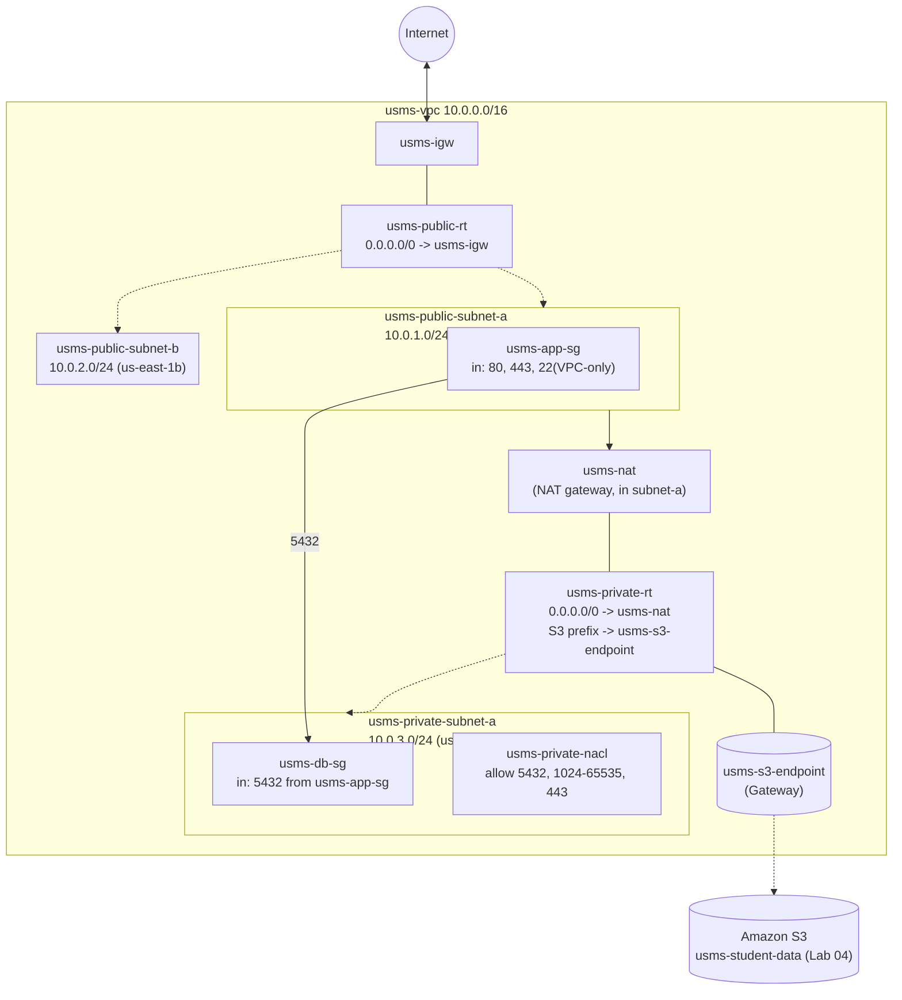
```mermaid
flowchart TB
    Internet(("Internet"))

    subgraph VPC["usms-vpc 10.0.0.0/16"]
        IGW["usms-igw"]

        subgraph PublicA["usms-public-subnet-a\n10.0.1.0/24 (us-east-1a)"]
            AppSG["usms-app-sg\nin: 80, 443, 22(VPC-only)"]
        end

        subgraph PublicB["usms-public-subnet-b\n10.0.2.0/24 (us-east-1b)"]
        end

        NAT["usms-nat\n(NAT gateway, in subnet-a)"]

        subgraph PrivateA["usms-private-subnet-a\n10.0.3.0/24 (us-east-1a)"]
            DbSG["usms-db-sg\nin: 5432 from usms-app-sg"]
            NACL["usms-private-nacl\nallow 5432, 1024-65535, 443"]
        end

        PublicRT["usms-public-rt\n0.0.0.0/0 -> usms-igw"]
        PrivateRT["usms-private-rt\n0.0.0.0/0 -> usms-nat\nS3 prefix -> usms-s3-endpoint"]

        S3EP[("usms-s3-endpoint\n(Gateway)")]
    end

    S3[("Amazon S3\nusms-student-data (Lab 04)")]

    Internet <--> IGW
    IGW --- PublicRT
    PublicRT -.-> PublicA
    PublicRT -.-> PublicB

    PublicA --> NAT
    NAT --- PrivateRT
    PrivateRT -.-> PrivateA

    PrivateRT --- S3EP
    S3EP -.-> S3

    AppSG -- "5432" --> DbSG
```

The diagram shows the whole traffic path this lab built: a request from the internet reaches the public subnets through the internet gateway; the private subnet's own outbound traffic leaves through the NAT gateway sitting in the public subnet; and traffic bound for S3 leaves through the gateway endpoint's managed route instead of through the NAT gateway at all. The two security groups show the group-to-group trust relationship (`usms-db-sg` only accepts port 5432 from `usms-app-sg`, never from a CIDR block), and the private NACL is the independent, subnet-wide backstop behind both.

*Image Source: authored for this lab (Mermaid diagram, not an external screenshot).*

---

## 5. Implementation Procedure

All commands were run with the AWS CLI v2 against Floci's endpoint (`http://localhost:4566`), from the project root `aws-floci-course/`, continuing from Lab 01's environment. Two interludes (CIDR notation, and security groups vs. NACLs) are conceptual only and have no accompanying command or screenshot.

 

#### Step 1: Resume the environment

Brought Floci up with `floci-up.sh` (already running, confirmed idempotent) and ran `floci-storage-check.sh`, which reported all six checks `[ok]`: container running under the Compose project, storage mode `hybrid`, a real bind mount to `~/floci-data`, and no dangling volumes.

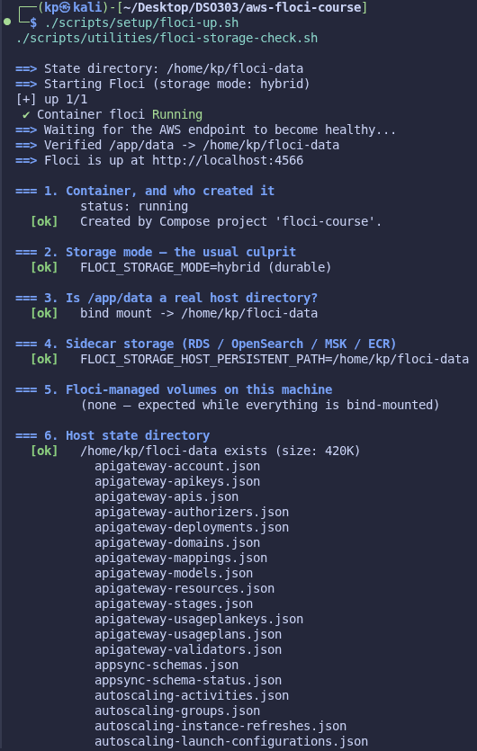

 

#### Step 2: Load the previous lab's environment and confirm identity

Sourced `configs/course.env` and `configs/lab-01.env`, confirmed identity with `whoami.sh` (account `000000000000`), and echoed the three values Lab 01 handed forward: the developer role, the developer user, and the account ID. One thing worth recording here: `USMS_ROLE_DEVELOPER` was populated by Lab 01 as a full ARN (`arn:aws:iam::000000000000:role/usms-developer-role`), not a bare role name, because Lab 01's `configs/lab-01.env` generation step queried `Role.Arn`. This matters directly in Step 3.

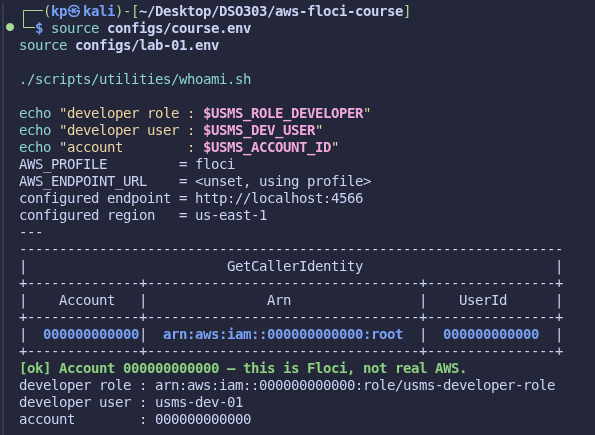

 

#### Step 3: Assume the developer role and create the VPC

Read `USMSDeveloperBase`'s live document (confirmed at default version `v2`, containing the read-everything statement, the region-conditioned VPC-building statement, and the identity-escalation `Deny`). Assumed `usms-developer-role` as `usms-dev-01` via the `usms-dev` profile, confirmed the resulting identity's ARN was `assumed-role/usms-developer-role/lab02-vpc-build` (temporary `ASIA...` credentials), then created `usms-vpc` with CIDR `10.0.0.0/16`, tagged consistently with the `usms-` naming convention.

Because `USMS_ROLE_DEVELOPER` already held the full role ARN (see Step 2), the role ARN used for `assume-role` was taken directly from that variable rather than reconstructed with `arn:aws:iam::${ACCOUNT}:role/${USMS_ROLE_DEVELOPER}` as literally written in the lab text, since that reconstruction would have produced a malformed, doubled ARN.

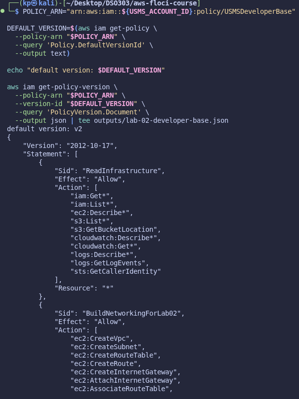

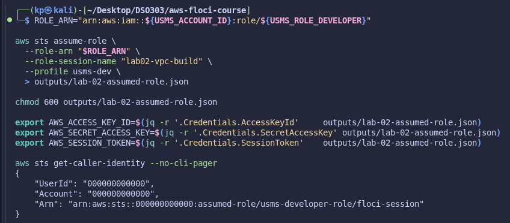

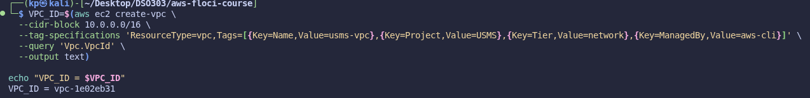

 

#### Step 4: Restore normal identity

Unset the three assumed-role environment variables, confirmed `whoami.sh` reported the identity back to `arn:...:root`, then read the VPC back as that different identity to confirm it exists in the account, not merely in the assumed-role session: `State: available`, `Default: False`.

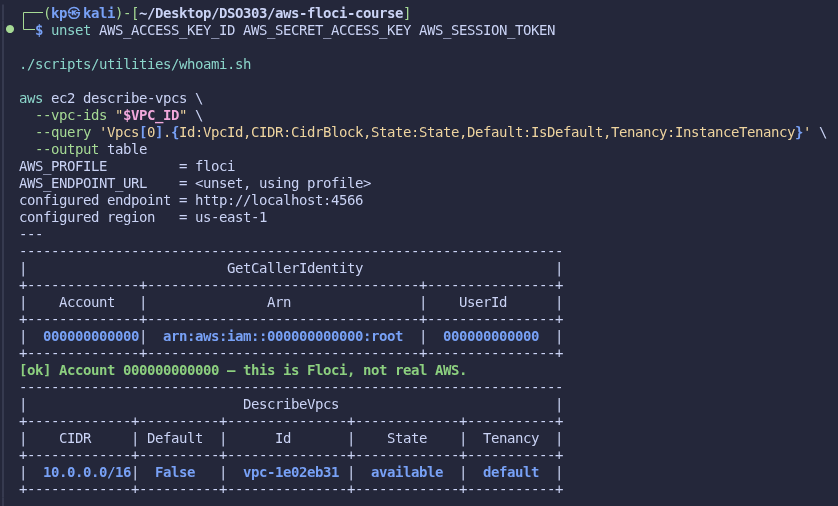

 

#### Step 5: Enable DNS support and DNS hostnames

Ran `modify-vpc-attribute` twice (DNS support, DNS hostnames), then verified both. The verify loop as written in the lab uses `${attr^}`, a Bash-4 capitalisation expansion that does not exist in zsh at all (not just an old-Bash-3.2 compatibility issue) and failed with `bad substitution`. Used the lab's own documented longhand fallback instead, which correctly returned `True` for both attributes.

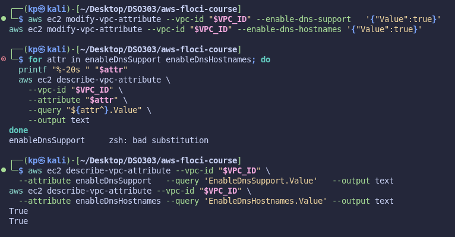

 

#### Step 6: Create and attach the internet gateway

Created `usms-igw` and attached it to `usms-vpc`. Verified `Attachments` contains exactly one entry, `State: available`, matching `VPC_ID`.

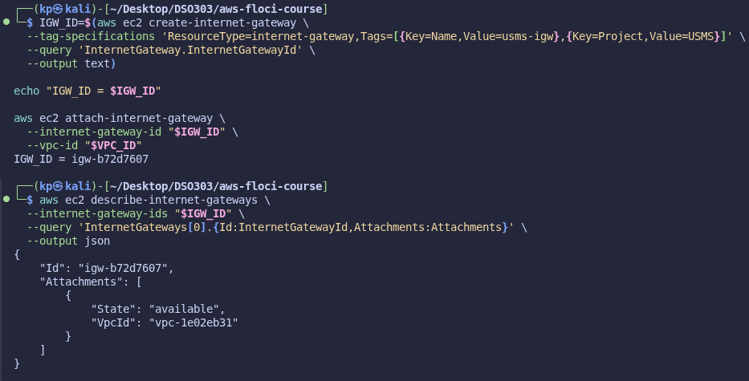

 

#### Step 7: Create the public subnet in us-east-1a

Created `usms-public-subnet-a` (`10.0.1.0/24`, `us-east-1a`), tagged `Tier=public`. Verified `State: available`, `Free: 251` (the five AWS-reserved addresses), and `PublicIP: False` at this point, correctly unset before Step 8.

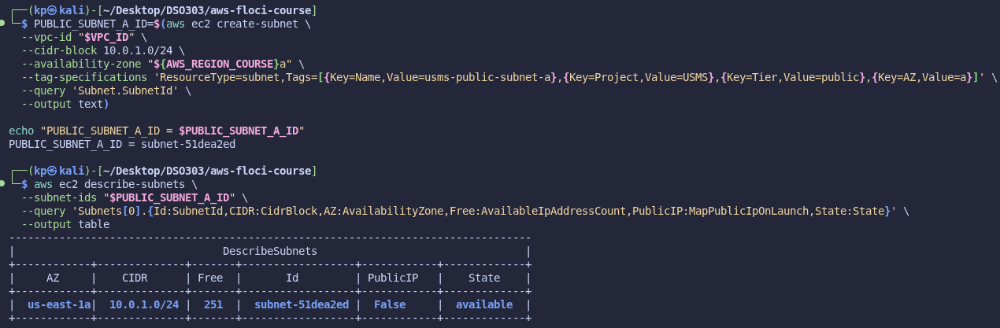

 

#### Step 8: Turn on auto-assign public IPv4 for the public subnet

Ran `modify-subnet-attribute --map-public-ip-on-launch`, verified `MapPublicIpOnLaunch` is now `True`.

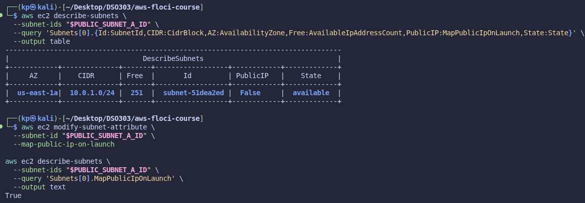

 

#### Step 9: Create the private subnet in us-east-1a

Created `usms-private-subnet-a` (`10.0.3.0/24`, `us-east-1a`), tagged `Tier=private`, deliberately without `MapPublicIpOnLaunch`. Verified both subnets side by side with a `sort_by`/tag-extraction query: public subnet shows `Public: True`, private shows `Public: False`.

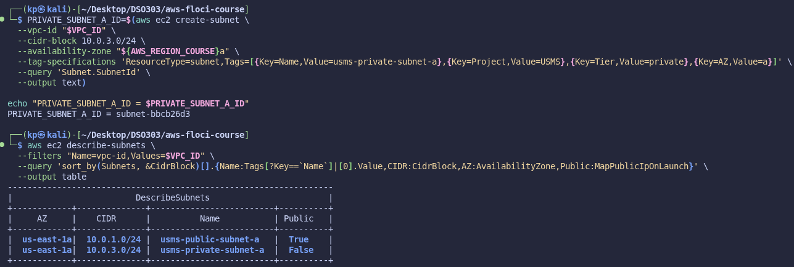

 

#### Step 10: Create the public route table and the default route

Created `usms-public-rt` and added a `0.0.0.0/0 -> usms-igw` route. Verified two routes present: `10.0.0.0/16 -> local` and `0.0.0.0/0 -> igw-...`, both `State: active`.

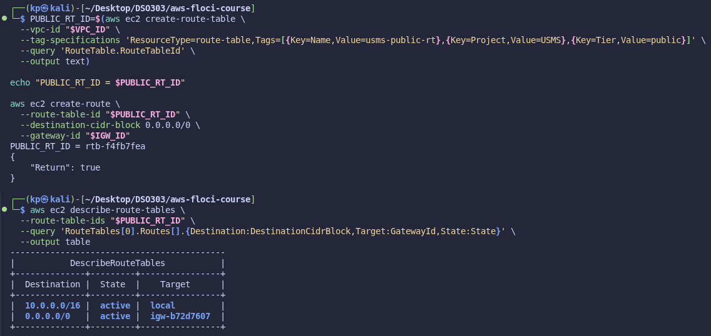

 

#### Step 11: Associate the public subnet with the public route table

Associated `usms-public-subnet-a` with `usms-public-rt`, capturing the association ID.

**Your turn:** Created a second public subnet, `usms-public-subnet-b` (`10.0.2.0/24`, `us-east-1b`), enabled auto-assign public IPv4, associated it with `usms-public-rt`, and tagged it consistently. Verified `usms-public-rt` now shows two associations, and `describe-subnets` for the VPC shows three subnets across two Availability Zones, exactly matching the exercise's expected result.

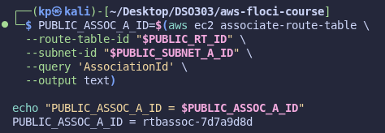

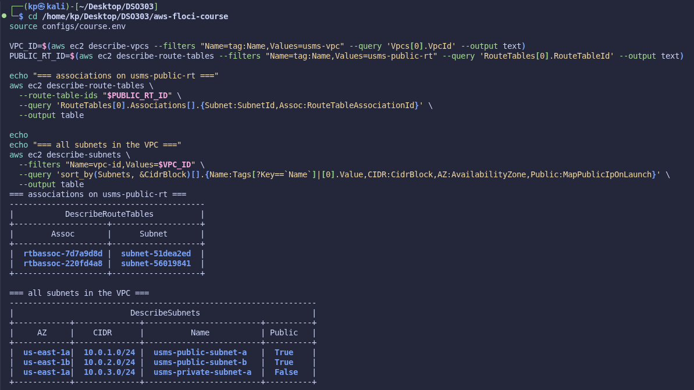

 

#### Step 12: Create the private route table and associate the private subnet

Created `usms-private-rt` and associated it with `usms-private-subnet-a`. No default route added at this stage, that is the entire, deliberate difference between this table and the public one.

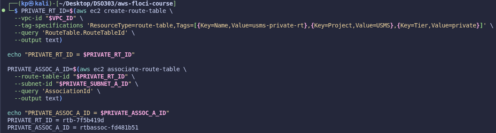

 

#### Step 13: Prove the two subnets are actually different

Read back, for both subnets, their associated route table and that table's `0.0.0.0/0` target. The public subnet's default route resolves to the internet gateway; the private subnet's resolves to `None`, since it has no default route at all. Confirmed there is no `Public` attribute anywhere on a subnet, that property is entirely a consequence of routing.

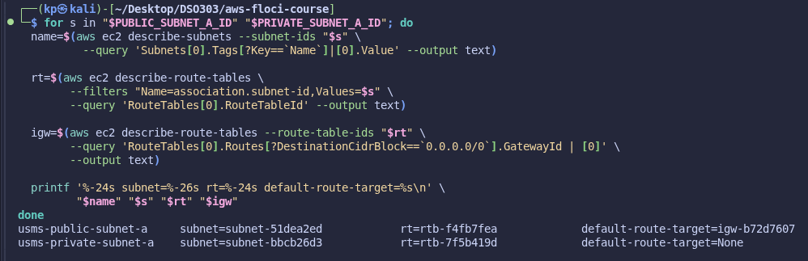

 

#### Step 14: Create the application security group

Created `usms-app-sg` with inbound TCP 80 from `0.0.0.0/0` and TCP 22 from `10.0.0.0/16` only (never open to the internet), plus the implicit allow-all-outbound rule every security group gets.

**Your turn:** Added a third inbound rule, TCP 443 from `0.0.0.0/0`, using the `--ip-permissions` long form so a description ("HTTPS from the internet") could be attached, since the short `--protocol`/`--port`/`--cidr` form has no way to carry one. Verified all three inbound rules present: 80, 443, 22.

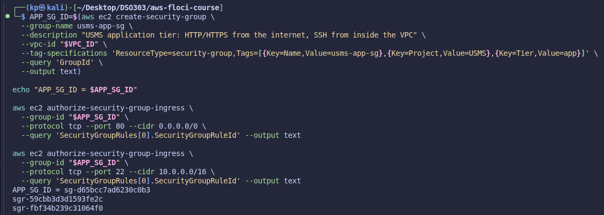

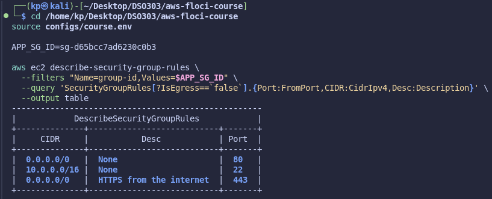

 

#### Step 15: Create the database security group, sourced from the application group

Created `usms-db-sg` and added an inbound rule for TCP 5432 whose source is `usms-app-sg`'s group ID (`UserIdGroupPairs`), not a CIDR block, so the rule keeps meaning the right thing regardless of how the application tier is re-addressed. Wrote the rule as a JSON document (`policies/usms-db-sg-ingress.json`) using an **unquoted** heredoc so `$APP_SG_ID` would expand into the file, the opposite quoting choice from a policy document, and for the opposite reason. Verified `SourceSG` holds the app group's ID and `SourceCIDR` is `None`.

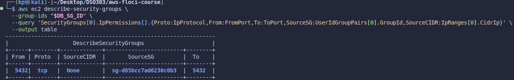

 

#### Step 16: Read the groups back, and understand what stateful means

Listed both security groups' inbound/outbound rule counts (plus the VPC's untouched `default` group), then traced a full request/reply/query/reply round trip between the web and data tiers: four security-group evaluations from only two written rules, because security groups are stateful and automatically permit return traffic on an established connection.

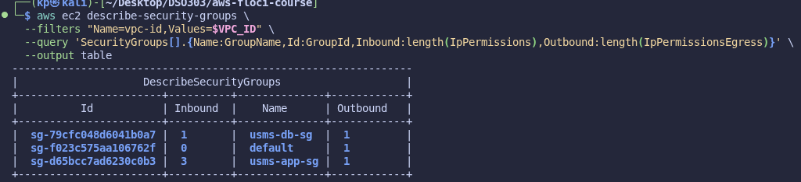

 

#### Step 17: Explore the default network ACL, then create a private one

Read the default NACL: rule 100 allows everything, in both directions, rule 32767 (permanent, undeletable) denies everything. Created `usms-private-nacl` with four explicit rules: inbound 5432 from the VPC, inbound the ephemeral-port range 1024-65535 (the return-traffic rule stateless NACLs require), outbound the ephemeral range back to the VPC, and outbound 443 so the data tier can reach the internet (via the NAT gateway) for OS updates.

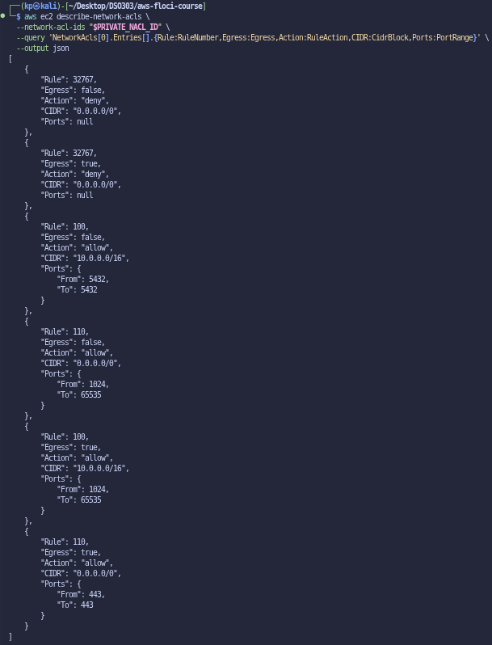

 

#### Step 18: Associate the private NACL with the private subnet

Every subnet already has a NACL (the default one), so this step used `replace-network-acl-association` rather than a plain associate call. Verified the new association's `Id` matches `usms-private-nacl`, `Default: False`.

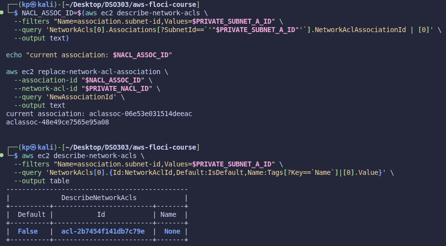

 

#### Step 19: Give the private subnet outbound internet access with a NAT gateway

Allocated an Elastic IP, then created `usms-nat` **in the public subnet** (the detail this step most commonly gets wrong: a NAT gateway placed in the private subnet has no path out at all), and waited for it to reach `available`.

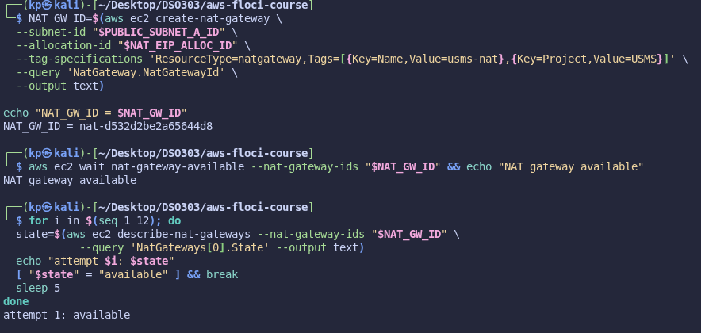

 

#### Step 20: Point the private route table at the NAT gateway

Added a `0.0.0.0/0 -> usms-nat` route to `usms-private-rt` using `--nat-gateway-id` (not `--gateway-id`, a different parameter for a different object type). Verified the private table's default route target is the NAT gateway, not the internet gateway.

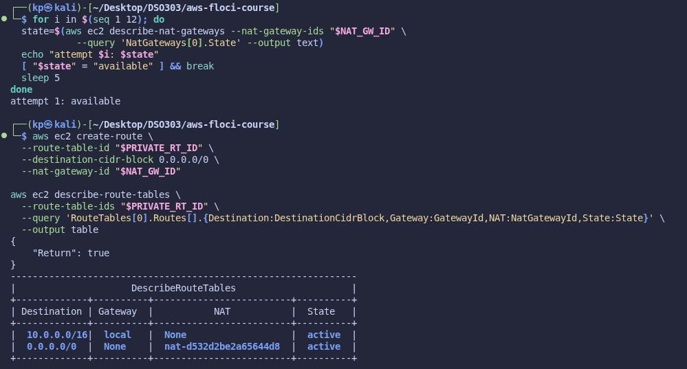

 

#### Step 21: Create the S3 gateway endpoint

Created a Gateway-type VPC endpoint for `com.amazonaws.us-east-1.s3`, attached directly to `usms-private-rt`, so traffic to the future `usms-student-data` bucket (Lab 04) never has to leave the AWS network through the NAT gateway. Verified the endpoint's `State: available` and its `RouteTables` list contains `usms-private-rt`.

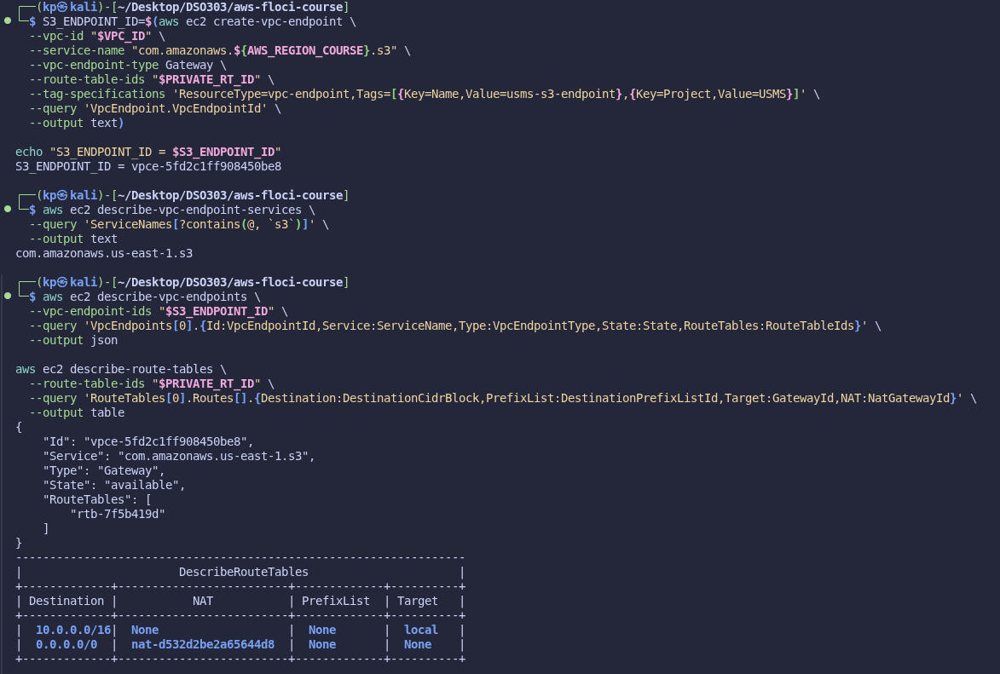

 

#### Step 22: Audit your tags

Ran `describe-tags` across every taggable resource type at once, filtered to `Project=USMS`, confirming every resource created in this lab carries the tag it should.

**Your turn:** Produced a sorted subnet inventory (name, CIDR, AZ, tier) using `sort_by()` on the `Tier` tag, which conveniently sorts `private` before `public` alphabetically without any extra logic, saved to `outputs/lab-02-subnet-inventory.txt`.

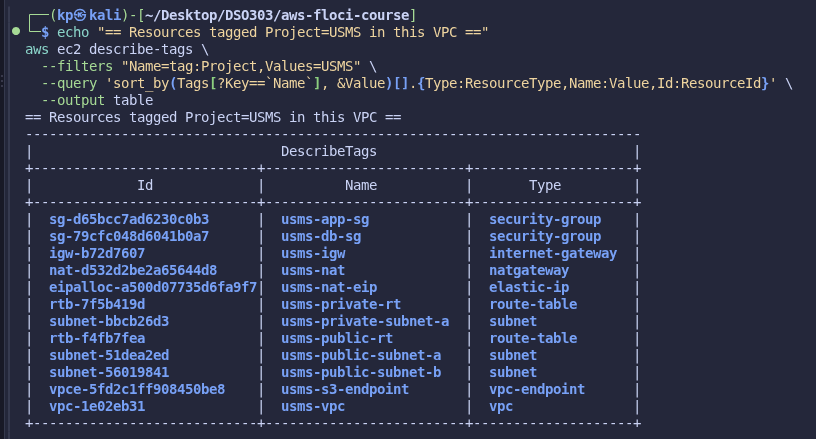

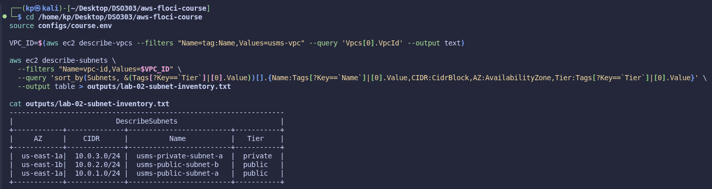

 

#### Step 23: Prove the network survives a restart

Recorded the VPC ID and the subnet/security-group counts to `outputs/lab-02-pre-restart.txt`, stopped and restarted Floci, then re-derived the VPC by **tag** (not by reusing the shell variable, which would only prove Bash remembers strings) and recorded the same three facts to `outputs/lab-02-post-restart.txt`. `diff` between the two files returned nothing, printing `PERSISTENCE PROVEN`.

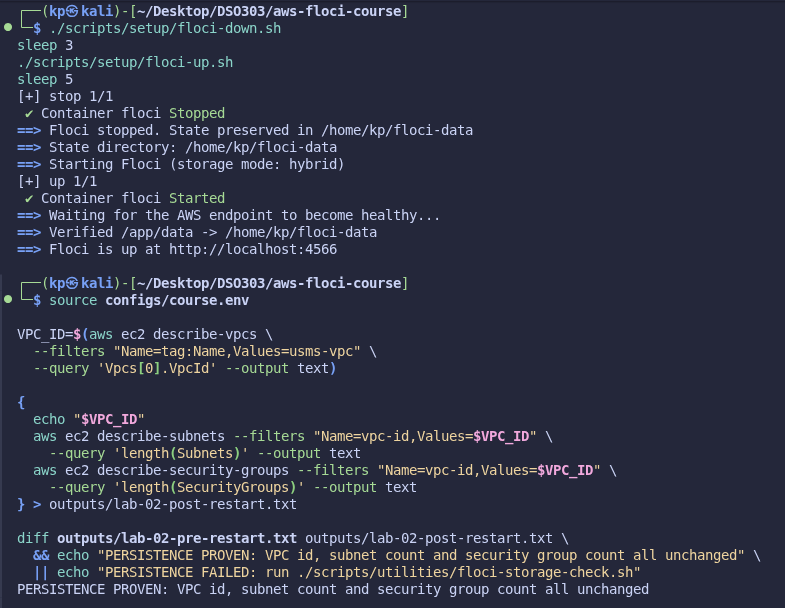

 

#### Step 24: Write configs/lab-02.env

Generated `configs/lab-02.env` with every ID Lab 03 onward will need (VPC, IGW, both public subnets, the private subnet, both route tables, both security groups, the private NACL, the NAT gateway and its Elastic IP allocation, and the S3 endpoint), each looked up by tag rather than reused from a shell variable, so a resource that does not exist is caught as `None` rather than silently recorded wrong. The completeness check correctly flagged exactly one gap: `USMS_PRIVATE_SUBNET_B`, which only exists if the optional Exercise 5 (a second private subnet in `us-east-1b`) is completed, it was not, and every other value populated.

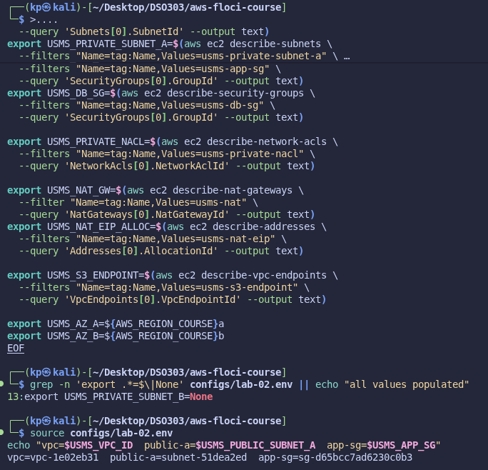

 

#### Step 25: Commit your work

Checked `git status --short` before adding anything: no path under `outputs/` appeared, and `git check-ignore -v` correctly named `.gitignore:8:outputs/*` as the rule protecting `outputs/lab-02-assumed-role.json`. The lab's literal `git add` command failed with a pathspec error, it names `scripts/utilities/verify-lab-02.sh` and `scripts/cleanup/lab-02-cleanup.sh`, which only exist after Section 9 (not yet reached), and `labs/lab-02-vpc/` was an empty directory at the time (Git does not track empty directories). Corrected the command to stage only what currently exists, `configs/lab-02.env` and `policies/usms-db-sg-ingress.json`, exactly per the lab's own documented guidance for committing before Section 9 is done. The commit itself is staged and prepared, pending Section 9's scripts before the final Lab 02 commit is made.

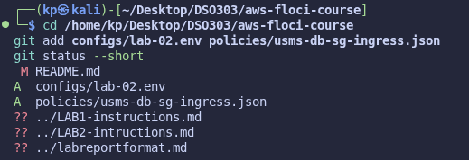

---

## 6. Results and Evidence

### 6.1 CLI Output

**Screenshot 1: VPC created as the assumed developer role (Step 3)**

*Image Source: `aws-floci-course/screenshots/lab2/s3.3.png`*

 

**Screenshot 2: Public vs. private subnet proof (Step 13)**

*Image Source: `aws-floci-course/screenshots/lab2/s13.png`*

 

**Screenshot 3: NAT gateway available (Step 19)**

*Image Source: `aws-floci-course/screenshots/lab2/s19.png`*

 

**Screenshot 4: Full tag audit (Step 22)**

*Image Source: `aws-floci-course/screenshots/lab2/s22.png`*

 

**Screenshot 5: Restart persistence proven (Step 23)**

*Image Source: `aws-floci-course/screenshots/lab2/s23.png`*

 

All 29 screenshots referenced in Section 5 above (`s1.png` through `s25.png`, including the `s3.1`/`s3.2`/`s3.3` sub-steps and the three "Your turn" exercises) constitute the complete CLI evidence trail for this lab and are stored in `aws-floci-course/screenshots/lab2/`.

### 6.2 AWS Console Verification

Not applicable. Floci is a CLI-only local emulator with no web console; all verification in this lab was performed and evidenced through the AWS CLI itself (`describe-*`, `--query`, `--output table`), which is the equivalent evidence source for a console-less environment.

---

## 7. Analysis and Discussion

Steps 1 through 25 were completed successfully: a VPC with DNS support and hostnames enabled, three subnets across two Availability Zones correctly split into public and private tiers by routing alone, an internet gateway and NAT gateway providing asymmetric public/private internet access, two security groups demonstrating group-to-group trust, a custom network ACL as an independent subnet-wide backstop, an S3 gateway endpoint avoiding NAT charges for in-region traffic, a full tag audit, a proven restart-survival test, and a generated `configs/lab-02.env` ready for Lab 03.

Several real issues were encountered and resolved during the lab:

- **`USMS_ROLE_DEVELOPER` holds a full ARN, not a bare name.** Lab 01 generated `configs/lab-01.env` by querying `Role.Arn`, so the variable already contains `arn:aws:iam::000000000000:role/usms-developer-role`. Lab 02 Step 3's literal command reconstructs a role ARN as `arn:aws:iam::${ACCOUNT}:role/${USMS_ROLE_DEVELOPER}`, which would have produced a malformed, doubled ARN. Resolved by using `$USMS_ROLE_DEVELOPER` directly wherever the lab calls for `ROLE_ARN`.

- **`${attr^}` is a Bash-only feature and fails entirely in zsh.** Step 5's verify loop uses Bash 4's capitalisation expansion to build `EnableDnsSupport` from `enableDnsSupport`. On zsh (this environment's actual shell) that syntax is not a compatibility gap, it does not exist at all, and fails with `bad substitution` regardless of version. Resolved using the lab's own documented longhand fallback, intended for old Bash 3.2 but equally correct here.

- **Step 25's commit command referenced files from a later section.** The lab's literal `git add` line includes `scripts/utilities/verify-lab-02.sh` and `scripts/cleanup/lab-02-cleanup.sh` (Section 9, not yet reached) and `labs/lab-02-vpc/`, which was an empty directory at the time. `git add` fails atomically if any named pathspec does not match, so the entire staging operation silently did nothing. Resolved by staging only the files that currently exist, exactly as the lab's own text anticipates for a commit made before Section 9.

- **One optional value intentionally left unset.** `configs/lab-02.env`'s completeness check correctly reported `USMS_PRIVATE_SUBNET_B=None`, since the optional Exercise 5 (a second private subnet for high availability) was not attempted. Every mandatory value populated correctly.

All observed outputs otherwise matched the lab's documented expected results, confirming the VPC network is correctly built and ready for Lab 03 (EC2) to consume via `configs/lab-02.env`.

---

## 8. Reflection

**1. What did you learn about this AWS service?**

The single most important idea in this lab is that "public" and "private" are not properties of a subnet at all, they are entirely a consequence of which route table is associated with it. A public and a private subnet are created with the identical API call; the only thing that ever differs is whether a `0.0.0.0/0` route exists and where it points. The second major idea was the stateful/stateless split between security groups and NACLs: a security group remembers a connection and permits its reply automatically, while a NACL must be given an explicit rule for the ephemeral-port return traffic or the connection will establish and then silently hang.

**2. What challenges did you encounter?**

The recurring theme was that example commands written for one shell or one point in the course sequence do not always transfer cleanly: a Bash-4-only expansion that simply does not exist in zsh, and a git command that assumed files from a later section already existed. Both were resolved by reading the lab's own documented fallbacks rather than treating the failure as evidence something else was wrong. The subtler challenge was the `USMS_ROLE_DEVELOPER` ARN-versus-name mismatch, which only became visible by tracing exactly how Lab 01 generated the value in the first place, rather than trusting the lab text's literal reconstruction.

**3. How would you apply this service in a real-world cloud environment?**

Directly as built here: a public/private split enforced entirely through routing rather than any subnet-level flag, group-to-group security rules instead of CIDR-based rules wherever the source is another set of instances rather than the open internet, a NAT gateway placed correctly in the public tier, and a gateway endpoint for any AWS service (S3, DynamoDB) a private subnet needs to reach, to avoid both the cost and the exposure of routing that traffic through the public internet.

**4. What additional concepts or features would you like to explore?**

Interface endpoints (the mechanism used for every AWS service other than S3 and DynamoDB, an elastic network interface with a private IP rather than a routing trick), and VPC Flow Logs, which would let the stateful-versus-stateless reasoning in Step 16 be checked against real observed traffic rather than reasoned through from the API alone.

---

## 9. Conclusion

This lab's objectives were fully achieved: a two-tier VPC network was built for USMS entirely as the least-privileged `usms-developer-role` from Lab 01, with public and private subnets correctly separated by routing across two Availability Zones, an internet gateway and NAT gateway providing the correct asymmetric internet access for each tier, security groups demonstrating stateful group-to-group trust, a network ACL providing an independent subnet-wide backstop, and an S3 gateway endpoint avoiding unnecessary NAT traffic for in-region AWS services.

Key concepts learned include the routing-only nature of "public" versus "private" subnets, longest-prefix-match route evaluation, the stateful/stateless distinction between security groups and NACLs, group-sourced versus CIDR-sourced security rules, and gateway versus interface VPC endpoints. Skills developed include reasoning through a multi-hop request path using only API reads (no real network traffic available in Floci), diagnosing shell-compatibility and out-of-sequence-command failures rather than assuming a deeper fault, and writing `configs/lab-0N.env` files that re-derive every value by tag so an incomplete resource is caught rather than silently recorded.

This network, recorded in `configs/lab-02.env`, is what Lab 03 (EC2) will attach an application server to, using the exact subnets, security groups, and instance profile this lab and Lab 01 built.

---

## 10. Appendix

| Item | Path |
|---|---|
| Security group rule document | `aws-floci-course/policies/usms-db-sg-ingress.json` |
| Generated IDs for later labs | `aws-floci-course/configs/lab-02.env` |
| Developer-role policy snapshot (Step 3) | `aws-floci-course/outputs/lab-02-developer-base.json` |
| Assumed-role credentials (Step 3, chmod 600) | `aws-floci-course/outputs/lab-02-assumed-role.json` |
| Subnet inventory (Step 22 Your turn) | `aws-floci-course/outputs/lab-02-subnet-inventory.txt` |
| Restart persistence proof (Step 23) | `aws-floci-course/outputs/lab-02-pre-restart.txt`, `lab-02-post-restart.txt` |
| All screenshots | `aws-floci-course/screenshots/lab2/` |

---

## Submission Checklist

- [x] Student information completed
- [x] Objectives stated
- [x] Introduction provided
- [x] Real-world use case described
- [x] Tools listed
- [x] System design included
- [x] Implementation documented
- [x] CLI outputs included
- [ ] Console screenshots attached *(not applicable: Floci is CLI-only, no web console)*
- [x] Analysis completed
- [x] Reflection completed
- [x] Conclusion written
- [x] Appendix attached
